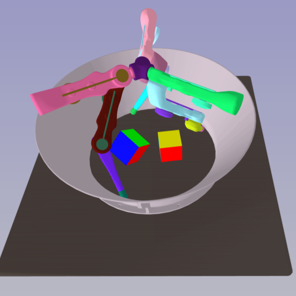

# Web-Based Visualizer for Simulation Environments

|  IsaacGym Simulator  |  |  |  |  |  |
|:--------------------:|:--------------------------------:|:--------------------------------:|:----------------------------:|:-----------------------------:|-----------------------------------:|
| **SAPIEN Simulator** |   |      |  |  |          |
| **Static URDF File** |           |          |          |        |      |

This repository hosts a browser-based 3D viewer for physical simulators. It offers users the ability to observe
simulations directly within their web browser, as an alternative to the default visualizer that comes with the
simulator.

The main feature of this repo is that you only need to modify a server lines of your code to port the
visualization on the default simulator viewer to the web visualizer. This feature is especially useful for visualizing
simulation on a headless server. For example, train and visualize the IsaacGym tasks
inside [jupyter notebook](example/isaacgym/train_isaacgym_remote_server.ipynb) on a remote server.

## Installation

From pip:

```shell
pip install sim_web_visualizer
```

From source:

**Note:** this visualizer does not have a Python version requirement but
IsaacGym requires Python 3.6, 3.7, or 3.8

```shell
git clone https://github.com/NVlabs/sim-web-visualizer
cd sim-web-visualizer && git submodule update --init --recursive
pip install -e .

```

Troubleshooting:
Try to install ZeroMQ libraries on your system if you encounter any related errors.

```shell
apt install libzmq3-dev # For ubuntu
brew install zmq # For Mac
```

## Examples

### IsaacGym Web Visualizer

Check the [IsaacGym Example](example/isaacgym/README.md) for information on running the
Web Visualizer on [IsaacGymEnvs](https://github.com/NVIDIA-Omniverse/IsaacGymEnvs).


### SAPIEN Web Visualizer

Check the [SAPIEN Example](example/sapien/README.md) for information on running the
Web Visualizer on [ManiSkill2](https://github.com/haosulab/ManiSkill2).


### URDF Web Visualizer

Check the [URDF Example](example/visualize_urdf/README.md) for information to visualize a static URDF file on Web
Visualizer.

## Troubleshooting

`Can "Upgrade" only to "WebSocket"`

This issue may arise if you have entered an incorrect URL into your browser. Ensure that the URL is in the
format `http://YOUR_IP_ADDRESS:YOUR_PORT_NUM/static/`. The `/static/` part of the URL is essential and should not be
omitted.

`404: Not Found`

Similar to the previous issue, the correct URL suffix should be `/static/`, and not `/static`. The trailing `/` is
mandatory and should not be omitted.

## Citing This Repo

This repository is a part of the [AnyTeleop Project](http://anyteleop.com/). If you use this work, kindly reference it
as:

```shell
@inproceedings{qin2023anyteleop,
  title     = {AnyTeleop: A General Vision-Based Dexterous Robot Arm-Hand Teleoperation System},
  author    = {Qin, Yuzhe and Yang, Wei and Huang, Binghao and Van Wyk, Karl and Su, Hao and Wang, Xiaolong and Chao, Yu-Wei and Fox, Dieter},
  booktitle = {Robotics: Science and Systems},
  year      = {2023}
}
```

## Acknowledgments

This repository is developed upon [MeshCat](https://github.com/rdeits/meshcat). The URDF loader is
adapted from [yourdfpy](https://github.com/clemense/yourdfpy).
We extend our appreciation to the developers and custodians of these open sources projects.

## License and Disclaimer

Web-Based Visualizer for Simulation Environments is released under the [MIT License](LICENSE).
