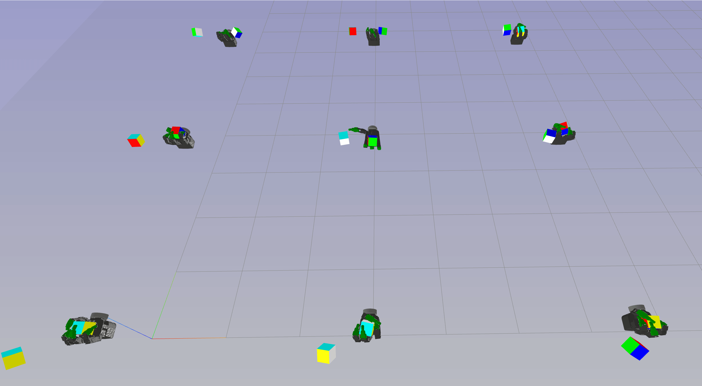

This documentation allows you to enable the web visualization of your normal IsaacGym code with tiny modification.

### Install dependencies for IsaacGymEnv

First install [IsaacGym](https://developer.nvidia.com/isaac-gym). Note: IsaacGym requires Python 3.6, 3.7, or 3.8


```shell
pip install hydra-core gym==0.23.1 rl-games torch pyvirtualdisplay omegaconf jinja2
# or pip install ."[isaacgym]" in the project root
```

### Examples

#### Train and visualize IsaacGym in Jupyter Notebook

```shell
pip install jupyter
# Launch Jupyter server
jupyter notebook --ip 0.0.0.0

```

Follow the instruction in [Jupyter Notebook Example](./train_isaacgym_remote_server.ipynb)


#### Visualize environment with random action agent

This example demonstrates how to visualize the environment with a random action agent. The steps are as follows:

1. Open the meshcat server inside the terminal. The default URL is `http://127.0.0.1:7000/static/` for localhost.
   ```shell
   meshcat-server
   ```

2. Link the config directory to avoid filepath errors for examples.
   ```shell
   ln -s IsaacGymEnvs/isaacgymenvs/cfg ./
   ```

3. Open a browser window and navigate to `http://127.0.0.1:7000/static/`

4. Run the minimal environment example `run_isaacgym_viz.py`:
   ```bash
   cd sim-web-visualizer/example/isaacgym
   python run_isaacgym_viz.py
   ```

For running code on a remote server, launch `meshcat-server` on this server,
and navigate to `http://YOUR_SERVERL_URL:7000/static/` in the web browser.



#### Visualize environment during RL training

This example demonstrates how to visualize the environment during RL training. The steps are similar to the previous
example, but you need to run the `run_isaacgym_training_viz.py` script:

   ```bash
   cd sim-web-visualizer/example/isaacgym
   python run_isaacgym_training_viz.py task=Ant headless=False # Remember to set headless=False to render on web
   ```

### More visualization control on the webpage

You can choose to visualize a single environment, disable the visualization of specific actors or links,
and toggle the visibility in the scene tree.


You can also disable the visualization of a specific actor or even a single link using the same way to toggle the
visibility in the scene tree.

### Options for Visualization

You have the flexibility to maintain the original IsaacGym viewer alongside the web visualizer by
setting `keep_default_viewer=True`.
This is particularly useful for comparing the rendering outputs from the browser and the original viewer.

```python
create_isaac_visualizer(port="6000", host="localhost", keep_default_viewer=True)
```

If you desire a purely headless configuration and solely want to use the web visualizer, like on a remote server,
set `keep_default_viewer=False`.

Regardless of your choice to keep the original viewer window or not, you should always set `headless=False` in the
environment constructor. This is required even if no X GUI (for instance, a monitor) is connected. This ensures that all
rendering requests to the original IsaacGym viewer are redirected to the web visualizer.

```python
envs = isaacgymenvs.make(
  **,
  headless=False,
  **,
)
```

## Frequent Problems

You may encounter an error that reads as
follows: `ImportError: libpython3.8.so.1.0: cannot open shared object file: No such file or directory`.

This issue is linked to `IsaacGym` and isn't connected to this repo. It generally occurs when you're utilizing a
Conda Python environment. To resolve this problem, you should add the Conda library path to your `LD_LIBRARY_PATH`.

```shell
export LD_LIBRARY_PATH=YOUR_CONDA_PATH/envs/YOUR_CONDA_ENV_NAME/lib
```


