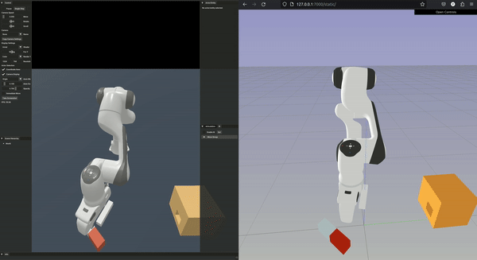

## Using the web visualizer on ManiSkill2
import sapien.core as sapien
import sapien.core as sapien

ManiSkill2 is a comprehensive environment suite for robot learning. For more information, please visit
the [ManiSkill2 website](https://maniskill2.github.io/).

This example provides a minimal code modification to port all visualization to the web browser.


## Examples

#### Replay ManiSkill2 Demonstration in Web Visualizer



```bash
# Install the dependencies for ManiSkill2 if you have not
pip install mani-skill2
# or pip install ."[sapien]" in the project root to install all required dep for the SAPIEN ManiSkill example
cd example/sapien

# Download ManiSkill2 demonstrations, you can also replace the `PegInsertionSide` with other task name
python -m mani_skill2.utils.download_demo "PegInsertionSide-v0"
python replay_maniskill_demo.py --traj-path demos/v0/rigid_body/PegInsertionSide-v0/trajectory.h5

```
Open a browser window and navigate to `http://127.0.0.1:7000/static/` to visualize the demonstration trajectory


#### Visualize ManiSkill2 environment with random robot action


1. Start the Meshcat server in the terminal. The default URL is `http://127.0.0.1:7000/static/` for localhost.

```shell
meshcat-server
```

2. Open a browser window and navigate to `http://127.0.0.1:7000/static/`.

3. Run the minimal example `run_maniskill2.py` modified from
   the [ManiSkill2 Quickstart documentation](https://haosulab.github.io/ManiSkill2/getting_started/quickstart.html).

```bash


# You may need to download the ManiSkill2 assets before running
python -m mani_skill2.utils.download_asset all
python run_sapien_viz.py
```

This will start the simulation, and you should be able to visualize it in your web browser via the provided link.

Please be aware that the errors `[svulkan2] [error] GLFW error: X11: The DISPLAY environment variable is missing`
and `[svulkan2] [warning] Continue without GLFW.` can be **disregarded** if you are operating on a headless server
without a screen. Despite SAPIEN triggering an error when the DISPLAY variable is absent, both SAPIEN and the visualizer
can function normally in such a situation.

## Limitations

Currently, the rendering of soft body simulation is not support for SAPIEN ManiSkill.
